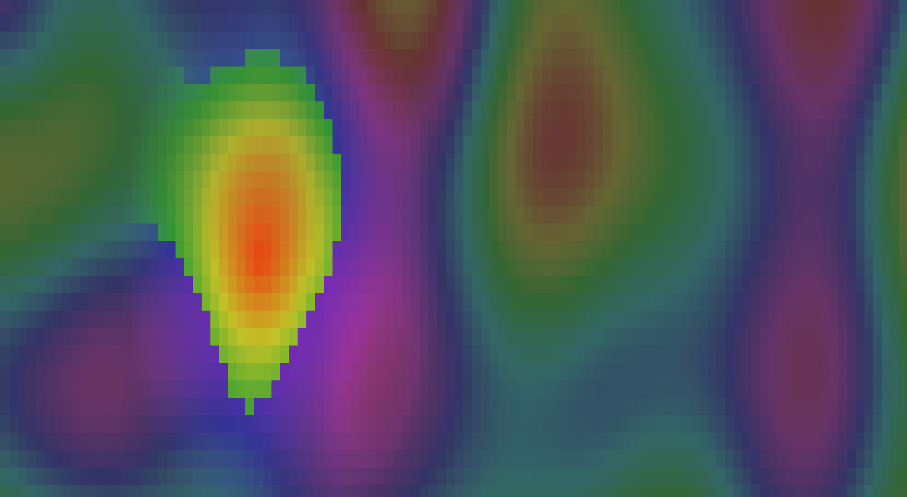

# Propeller Vision

A read-only console monitor that observes a running `propeller-engine` process and visualizes the state of its playback Loop. It connects to the engine over its Unix domain socket protocol and only ever issues query commands (`status`, `project`, `get_position`) — it never sends control/mutation commands, so it can't conflict with or corrupt engine state. It offers three Views: a **Dashboard** (a Position playhead plus a status panel), a **Plasma View** (a continuously animated, note-reactive color field), and a **Space View** (a vertical-scroller space visualization, where each Track's notes scroll down their own lane and a ship tracks pitch).



## Dependencies

- Python >= 3.11
- [`textual`](https://pypi.org/project/textual/) >= 8.2.8
- A running `propeller-engine` process (>= 0.7.0) reachable over its Unix domain socket

## Installation

This project uses [`uv`](https://docs.astral.sh/uv/) for dependency management:

```sh
uv sync
```

## Usage

Run against the engine's default socket (`/tmp/propeller.sock`, or `$PROPELLER_SOCK` if set):

```sh
uv run propeller-vision
```

Common flags:

```sh
propeller-vision --socket /tmp/propeller.sock   # path to the engine's Unix socket
propeller-vision --view plasma                  # dashboard (default), plasma, or space
propeller-vision --position-interval 0.1        # position poll interval in seconds
propeller-vision --status-interval 1.0          # status/project poll interval in seconds
propeller-vision --debug                        # log to ~/.propeller-vision.log
```

## Authors

- Thomas Volk

## License

[Apache License 2.0](LICENSE)
